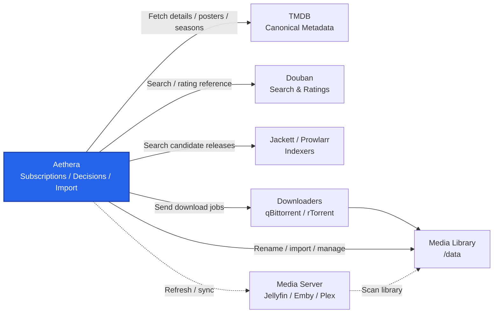

# Aethera

[](./LICENSE)
[](https://hub.docker.com/r/n120318/aethera)
[](https://github.com/120318/Aethera/releases)

[中文](./docs/readme-zh.md)

## Project Introduction

Aethera is a self-hosted media resource management service for BT users. It focuses on resource search, download dispatch, file transfer, media scraping, and library import, providing automation for the full media management workflow.

> **Note**
> 99.99% of this project was written by AI.

### Preface

Radarr and Sonarr are mature reference projects in media automation, but their support for Chinese media metadata and Chinese tracker ecosystems is not always a good fit. There have also been similar attempts in the Chinese community, but many of them cover too broad a scope and spread focus away from the core viewing workflow and advanced configuration.

As a media enthusiast, I built Aethera for this workflow. It integrates Douban search and ratings, fits Chinese user habits, and keeps the scope focused on viewing automation from resource discovery to library import. Aethera now covers my personal viewing workflow, so I decided to open source it for users with similar needs.

### Architecture

Aethera is designed for users who already run their own indexers, download clients, and media servers, but still need a dedicated layer for subscriptions, release selection, task tracking, naming, and library import.



### Feature List

- **Media subscriptions**: track movies and TV shows, then create search and download tasks.
- **Metadata matching**: use TMDB for titles, posters, seasons, episodes, and details; use Douban search and ratings as an additional reference.
- **Resource discovery**: query indexers through Jackett or Prowlarr. Parsing quality depends on release naming; Private Tracker releases are usually more consistent.
- **Release decisions**: parse quality, version, source, subtitles, release group, and related attributes, then filter by configured policies.
- **Download dispatch**: send selected resources to qBittorrent or rTorrent and record active tasks and history.
- **Library import**: configure media directories, default paths, naming templates, and post-download import behavior.
- **Media server integration**: trigger refresh or sync workflows for Jellyfin, Emby, or Plex after import.
- **Container deployment**: only Docker-based deployment is supported.

### What We Do

- Manage subscriptions, search, filtering, download dispatch, naming, and import.
- Provide a Chinese-user-friendly workflow.

### What We Do Not Do

- Aethera does not host, bundle, or distribute any media resources.
- Aethera does not replace Jackett, Prowlarr, or tracker indexers.
- Aethera does not replace qBittorrent, rTorrent, or other download clients.
- Aethera does not replace Jellyfin, Emby, Plex, or other media servers.
- Aethera does not add general-purpose features unrelated to media automation.

## Usage

### Installation

#### Requirements

- Docker Engine
- Docker Compose v2
- TMDB API key
- At least one indexer, such as Jackett or Prowlarr
- At least one download client, such as qBittorrent or rTorrent

#### Install From Release

1. Create a deployment directory:

```bash
mkdir -p aethera
cd aethera
```

2. Download the release files:

```bash
curl -L -o compose.yaml https://github.com/120318/Aethera/releases/latest/download/compose.yaml
curl -L -o .env https://github.com/120318/Aethera/releases/latest/download/env.example
```

3. Edit `.env`:

```dotenv
AETHERA_IMAGE=n120318/aethera
AETHERA_TAG=latest
AETHERA_HTTP_PORT=8173
AETHERA_CONFIG_PATH=./config
AETHERA_MEDIA_PATH=./media
PUID=1000
PGID=1000
```

Required settings:

- `AETHERA_IMAGE`: Docker image name. Use `n120318/aethera` for the official image.
- `AETHERA_TAG`: image tag. `latest` follows the latest release; you can also pin a specific version.
- `AETHERA_HTTP_PORT`: host port for the Aethera Web UI. The default is `8173`; the container port is always `3001`.
- `AETHERA_CONFIG_PATH`: application data directory. SQLite database, cache, logs, and torrent cache files are stored here. Back up this directory before upgrades or migration.
- `AETHERA_MEDIA_PATH`: host media directory. It is mounted into the container as `/data`; library paths and naming templates should be configured based on this mount.
- `PUID` / `PGID`: host user and group IDs used when the container writes to `/config` and `/data`. Use an account that can write to the media directory.

Optional settings:

- `AETHERA_ADMIN_PASSWORD`: one-time initial admin password. It is only used during first initialization; change it in the UI afterwards.

4. Start Aethera:

```bash
docker compose -f compose.yaml up -d
```

5. Open http://localhost:8173

### Other Documentation

- [Features](./docs/features.md)
- [System architecture](./docs/system-architecture.md)
- [Development](./docs/dev.md)
- [Contributing](./docs/contributing.md)
- [Release](./docs/release.md)
- [HTTPS reverse proxy](./docs/https-reverse-proxy.md)
- [Documentation index](./docs/index.md)

### License

Aethera is licensed under the [GNU Affero General Public License v3.0](./LICENSE).
