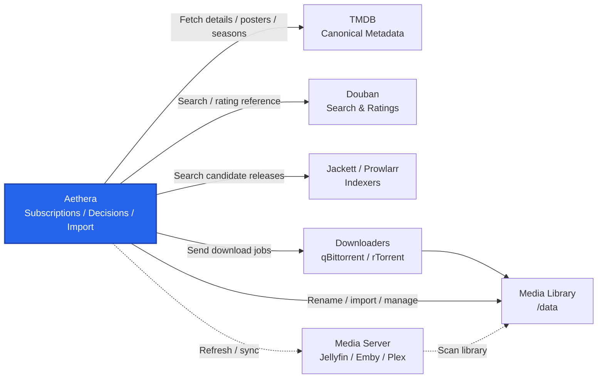

# Aethera

[](../LICENSE)
[](https://hub.docker.com/r/n120318/aethera)
[](https://github.com/120318/Aethera/releases)

[English README](../README.md)

## 项目介绍

Aethera 是一款面向 BT 用户的自托管影视资源管理服务，围绕资源搜索、下载派发、文件转移、媒体刮削与入库，提供完整的媒体管理自动化能力。

> **说明**
> 本项目 99.99% 的代码由 AI 编写。

### 前言

在影视自动化管理领域，Radarr 和 Sonarr 已经是极其成熟的行业标杆，但它们对中文影视生态以及国内资源站点的支持略显水土不服。虽然国内也有过类似的尝试，但往往因功能过于宽泛而分散了精力，在“核心观影体验”和“高级配置自定义”上难以兼顾。

作为一名影视爱好者，我开发了 Aethera。深度集成了豆瓣搜索与评分，全面适配中国用户的使用习惯，并始终将功能聚焦于纯粹的观影全流程自动化。如今，Aethera 已经完全满足了我个人的全部观影诉求。我决定将它开源，希望能为有着同样痛点的你提供一个更专一、更懂你的选择。


### 架构

Aethera 面向已经运行索引器、下载器和媒体服务器的用户，但这些用户仍然需要一个专门的中间层处理订阅、资源选择、任务跟踪、命名和入库。



### 功能列表

- **媒体订阅**：跟踪电影、剧集，创建后续搜索和下载任务。
- **元数据识别**：使用 TMDB 识别标题、海报、季集结构和详情；支持豆瓣搜索与中文影视评分参考。
- **资源发现**：通过 Jackett 或 Prowlarr 查询索引器；资源解析依赖发布命名规范，Private Tracker 通常更稳定。
- **发布决策**：解析质量、版本、来源、字幕、发布组等属性，并按配置策略筛选资源。
- **下载派发**：把选中的资源发送到 qBittorrent 或 rTorrent，记录活动任务和历史记录。
- **入库管理**：配置媒体目录、默认目录、命名模板，管理下载完成后的文件入库。
- **媒体服务器联动**：连接 Jellyfin、Emby 或 Plex，入库后触发刷新或同步。
- **容器部署**：只支持Docker容器部署。

### 我们做什么

- 管理订阅、搜索、筛选、下载派发、命名和入库。 
- 中文/中国友好

### 我们不做什么

- 不内置、托管或分发任何媒体资源。
- 不替代 Jackett、Prowlarr 或站点索引器。
- 不替代 qBittorrent、rTorrent 等下载客户端。
- 不替代 Jellyfin、Emby、Plex 等媒体服务器。
- 不扩展与观影自动化无关的泛用功能。

## 使用方式

### 安装

#### 前置准备

- Docker Engine
- Docker Compose v2
- TMDB API key
- 至少一个索引器（Jackett 或 Prowlarr）
- 至少一个下载器（qBittorrent 或 rTorrent）

#### 从 Release 安装

1. 创建部署目录：

```bash
mkdir -p aethera
cd aethera
```

2. 下载发布文件：

```bash
curl -L -o compose.yaml https://github.com/120318/Aethera/releases/latest/download/compose.yaml
curl -L -o .env https://github.com/120318/Aethera/releases/latest/download/env.example
```

3. 编辑 `.env`：

```dotenv
AETHERA_IMAGE=n120318/aethera
AETHERA_TAG=latest
AETHERA_HTTP_PORT=8173
AETHERA_CONFIG_PATH=./config
AETHERA_MEDIA_PATH=./media
PUID=1000
PGID=1000
```

关键配置：

- `AETHERA_IMAGE`：Docker 镜像名。普通部署保持 `n120318/aethera` 即可。
- `AETHERA_TAG`：镜像版本。`latest` 会跟随最新发布版，也可以改成固定版本号。
- `AETHERA_HTTP_PORT`：Aethera Web UI 暴露到宿主机的端口，默认 `8173`，容器内端口固定为 `3001`。
- `AETHERA_CONFIG_PATH`：应用数据目录。SQLite 数据库、缓存、日志和 torrent 缓存都会写入这里，升级或迁移前应备份该目录。
- `AETHERA_MEDIA_PATH`：宿主机媒体目录。容器内固定挂载为 `/data`，入库路径和命名模板应基于该目录配置。
- `PUID` / `PGID`：容器写入 `/config` 和 `/data` 时使用的宿主机用户/用户组 ID。建议设置为拥有媒体目录写入权限的用户。

可选配置：

- `AETHERA_ADMIN_PASSWORD`：一次性初始管理员密码。只用于首次初始化，建议启动后在 UI 中修改。

4. 启动：

```bash
docker compose -f compose.yaml up -d
```

5. 打开 http://localhost:8173

### 其他文档

- [功能说明](./features.md)
- [系统架构](./system-architecture.md)
- [开发说明](./dev.md)
- [贡献指南](./contributing.md)
- [发布说明](./release.md)
- [HTTPS 反向代理](./https-reverse-proxy.md)
- [文档索引](./index.md)


### License

Aethera is licensed under the [GNU Affero General Public License v3.0](../LICENSE).
