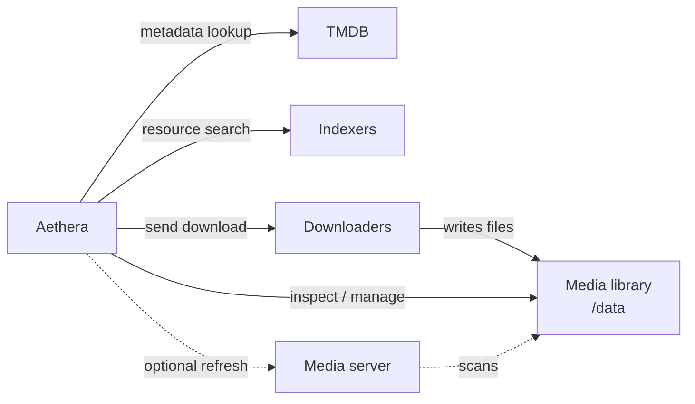

# System Architecture

Aethera coordinates metadata, resource discovery, download execution, and local media library management from one Docker deployment.

## Runtime Shape

The release deployment runs as one container:

- FastAPI backend, scheduler, command worker, and static frontend.
- SQLite database and runtime files under `/config`.
- Host media directory mounted into the container at `/data`.

Development uses `docker-compose.dev.yml` with separate backend, frontend, and SQLite inspection containers. See [development](./dev.md).

## External Systems

## Component Responsibilities

- **TMDB** is the canonical metadata provider. Aethera uses it for media identity, titles, posters, seasons, episodes, and detail pages.
- **Indexers** are search providers. They return candidate releases, but they do not manage downloads or media files.
- **Downloaders** execute download tasks. Aethera selects a configured downloader and sends resources to it.
- **Media library** is the mounted host media root. Aethera inspects files, tracks layout, and manages directory workflows there.
- **Media servers** are optional. They can be configured for refresh and sync workflows, but they are not required to start Aethera.

## Configuration Boundaries

- Deployment settings live in `.env` and Compose: image tag, ports, host paths, `PUID`, and `PGID`.
- Application settings live in SQLite under `/config/db`: TMDB, downloaders, indexers, directories, naming templates, quality profiles, and related UI settings.
- `config.yaml` is not used at runtime.

## First-Run Setup

The setup wizard moves through the core dependency chain:

1. Admin password.
2. TMDB API key.
3. Downloader.
4. Indexer.
5. Naming templates.
6. Media directories.
